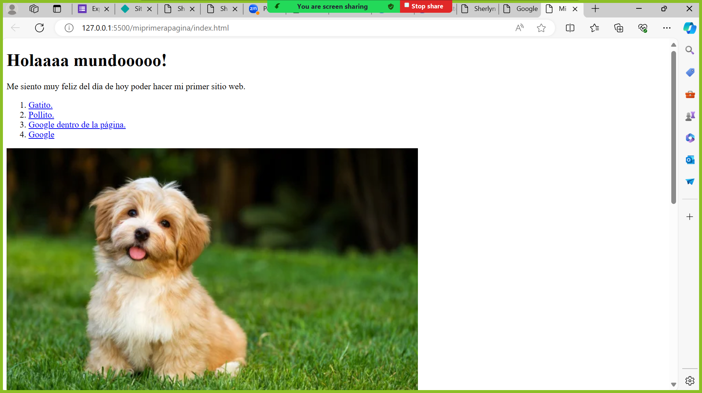

# Mi primera pagina web de Technolochicas PRO

Este portafolio es desarrollado para poner en práctica las habilidades obtenidas dentro del bootcamp de desarrollo frontend.

Fue desarrollado con HTML, CSS con el uso de animaciones de bibliotecas externas.

[Proyecto en linea](https://)

- Capturas de pantalla

- Tecnologías

* HTML
* CSS

Ocupamos bibliotecas extra.

Creado por Sherlyn en el bootcamp de Technolochicas PRO.